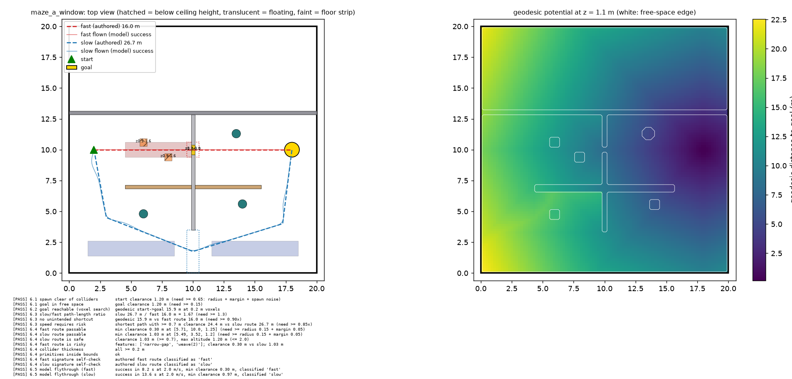

# Drone Maze Speed-Navigation

A vision-based quadrotor policy (Crazyflie in Isaac Lab, PPO via rsl_rl) learns to fly a
hand-built 3D maze from a fixed start to a fixed goal. Each maze offers two routes: a
**slow, safe** one and a **fast, risky** one. The question is whether the policy's route
choice shifts from safe to fast as its flying gets better, and whether that shift can be
measured rather than eyeballed.

> **Status: environment built and validated offline; not yet trained.** No results
> exist yet. The results section below stays empty until `eval/evaluate.py` produces
> real numbers on ARC. The only numbers in this README are geometric checks from the
> maze configs (`tools/check_mazes.py`, reproducible on a laptop).

## Task

| | |
|---|---|
| Robot | Crazyflie 2.x (`CRAZYFLIE_CFG`, Isaac Lab's quadcopter demo base) |
| Action | `[vx, vy, vz, yaw_rate]` in the heading frame, 20 Hz. A fixed geometric controller (`drone/controller.py`, 200 Hz) turns it into body thrust and torque. The policy does not learn to stabilise. |
| Observation | 64×64 forward RGB camera, body-frame velocity, angular rate, 6D rotation, body-frame goal vector, last action. No map, no route, no waypoints. |
| Termination | goal reached · collision (analytic, checked at every 200 Hz physics sub-step) · 40 s timeout |
| Reward | potential-based geodesic shaping · per-step time penalty · collision penalty · goal bonus (`env/reward.py`) |

## The three mazes

Every wall, pillar, slot, and hanging block is a primitive in a YAML file
(`configs/mazes/`). The Isaac scene, the collision ground truth, and the validator all read
that file. Nothing is placed by hand in the GUI.

| Maze | Fast route (risky) | Slow route (safe) | Length slow / fast |
|---|---|---|---|
| **A: window** | weave two hanging blocks, thread a 0.8 × 0.8 m window | wide south door, ground level | 26.7 / 16.0 m = **1.67** |
| **B: overpass** | climb to 2.9 m through two 1 m-tall slots over low partitions | round a solid core block | 34.5 / 16.1 m = **2.14** |
| **C: slalom** | 1.1 m doors plus a five-obstacle slalom of pillars and hanging blocks | wide north ring corridor | 30.6 / 18.3 m = **1.67** |



(`docs/mazes/` has all three: layout, authored routes, routes flown by the laptop
rigid-body model, and the geodesic potential.)

## Design decisions worth reading

**Speed has to require risk, and the validator proves it.** A longer route is not enough on
its own. If a short path with wide clearance existed, the "fast route" would just be a worse
line and route choice would measure nothing. `maze/validate.py` finds the shortest path that
keeps the slow route's clearance (0.7 m) everywhere, and requires it to be ≥ 0.85× the slow
route's length. It also checks the reverse: no geodesic path beats the authored fast route
by more than 10%, so there is no unintended shortcut.

**The reward is tuned to a computed break-even, not by feel.** With Φ(terminal) = 0 and the
shaping γ equal to PPO's γ, the shaping term gives every trajectory the same discounted
return (Ng et al. 1999; `tests/test_reward.py` checks this numerically, including a detour
that first moves away from the goal). Route choice is therefore decided by time penalty and
discounting against crash risk only. `maze.routes.break_even` computes the crash probability
below which the fast route is worth it: **21% (A), 32% (B), 13% (C)** under the default
weights. The expected story follows directly. Early on, the fast route crashes more often
than that, so the policy should prefer the slow route. As control improves the fast route
crosses the threshold. Whether training actually does this is exactly what the evaluation
measures.

**Collision is analytic, with PhysX as a cross-check.** An exact SDF of the maze primitives
(`maze/geometry.py`) is checked at every physics sub-step, so a 4 m/s drone cannot tunnel
through a wall between 20 Hz policy steps. The same function drives the validator, the
potential field, and the env. PhysX contacts are logged alongside it, and the sim probes
require the two to agree.

**Route choice is measured, not inferred from speed.** Each route has signature regions
(the window, the slots, the doors). Every episode is classified fast / slow / both / none,
and the evaluator reports route share and success rate *per route* for each checkpoint. That
separates "picked the fast route" from "flew the slow route faster".

## Validation (CLAUDE.md §6)

| Check | Where | Status |
|---|---|---|
| 6.1 spawn clear of colliders | pure + sim hover probe | pure: pass (all 3) · sim: pending |
| 6.2 goal reachable (voxel search) | pure | pass (all 3) |
| 6.3 route gap ≥ 30%, no unintended shortcut, speed requires risk | pure | pass (all 3) |
| 6.4 passable at drone radius, walls ≥ 0.2 m, measured footprint ≤ radius | pure + sim | pure: pass · sim footprint: pending |
| 6.5 scripted flythrough of both routes | laptop rigid-body model + sim | model: pass (all 3) · sim: pending |
| 6.6 visual distinguishability | sim frame grid, human check | pending |

`tools/check_mazes.py` runs the pure half in about 10 s. `eval/validate_sim.py` runs the
rest in Isaac Sim, plus Phase-0 probes: controller step responses read back from PhysX, a
forced-crash probe with termination off (the analytic check and PhysX must both fire in
every env, including the last one, with no tunnelling), a reward-balance audit, and a
throughput measurement.

## Results

*Pending: no training run yet.* This section will hold `results/eval/<run>/table.md`
(success rate with 95% Wilson CI, collision rate, time-to-goal, and route share by
checkpoint, plus random and scripted baselines), `curves.png`, and the early and final
representative flythrough GIFs.

## Limitations (stated up front)

- **Memorisation vs. generalisation.** One fixed maze per policy, a fixed start (±0.3 m,
  ±15° noise), and a goal vector in the observation. That is enough to memorise a route. A
  good result shows the policy learned *this* maze, not general route evaluation. The
  `observation.zero_image=true` ablation (same input shape, blank image) measures how much
  the camera actually contributes. "Vision-based" claims should wait for that number.
- The analytic collision sphere (0.15 m) is a deliberate safety bubble, about twice the
  Crazyflie's real reach. The sim probe checks the measured footprint against it.
- Out of scope for this build (per spec): domain randomisation, procedural mazes,
  multi-agent, memory/recurrence, sim-to-real.

## Running it

Laptop (pure modules; no Isaac):

```bash
pip install "numpy<2" pyyaml torch matplotlib pytest rsl-rl-lib==2.3.1 tensorboard
python -m pytest tests -q              # 41 tests, incl. the CNN policy inside the real rsl_rl runner
python tools/check_mazes.py            # §6 pure checks + plots -> results/maze_checks/
```

### Running on ARC (Falcon, 1 × L40S; see `ISAAC_SIM_PLAYBOOK.md`)

```bash
cd ~/ondemand/data/maze-navigation-drone && git pull --ff-only
PY=~/miniconda3/envs/rtn/bin/python     # reuses the payload project's verified Isaac env
S="sbatch --account=<ACCT> --mail-user=<you>@vt.edu"
M="--set maze.config=configs/mazes/maze_a_window.yaml"

bash arc/setup_env.sh --verify                                   # versions, pip check, tests
$S arc/validate.slurm $M                                         # §6 in-sim + probes + throughput
$S arc/train.slurm --run-name a_s42 --resume auto $M             # PPO; resubmit identically on timeout
$S arc/eval.slurm --run results/runs/a_s42 --baselines random scripted_fast scripted_slow
$S arc/record.slurm --run results/runs/a_s42 --checkpoints 250 2000
grep -c "PhysX error" logs/slurm/<log>.out                       # must be 0
```

## Layout

| Path | What |
|---|---|
| `configs/train.yaml`, `configs/mazes/*.yaml` | every number the code uses |
| `maze/` | spec loader, analytic SDF, voxel grid + geodesic field, routes, §6 validator (pure) |
| `drone/` | controller, laptop rigid-body model, scripted waypoint pilot (pure torch) |
| `env/maze_env.py` | the Isaac Lab env (the only Isaac module besides the eval entry points) |
| `env/reward.py`, `env/obs_layout.py` | reward and observation layout (pure) |
| `policy/cnn_actor_critic.py` | CNN actor-critic registered into rsl_rl 2.3.1 |
| `training/` | config/overrides, rsl_rl seam, train entry point |
| `eval/` | `validate_sim.py`, `evaluate.py`, `record_video.py`, metrics |
| `arc/` | SLURM launchers and env setup |
